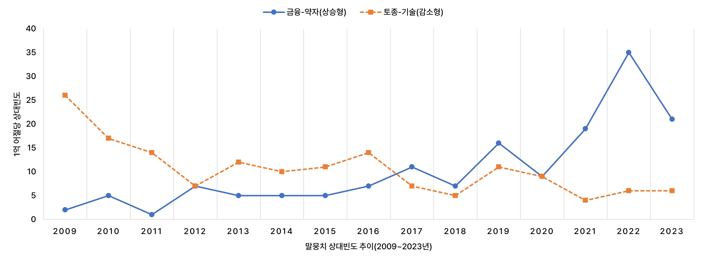

# 🧬 KNWD: Korean Nonce Word Database

**KNWD**는 대규모 한국어 말뭉치 분석을 통해 ‘N+N’형 임시어를 자동적으로 추출한 후, 이를 체계적으로 판정하고 분석한 한국어 임시어 데이터베이스입니다.

## 📌 프로젝트 개요

- **2025-09-15** — ver.1 최초 배포
- **목표**: 언어 사용자에 의해 특정 순간 창조된 ‘임시어(nonce word)’ 중, ‘N+N’형 임시어 추출·판정·분석
- **데이터 수**: 총 8,165개
- **데이터 형식**: Excel (.xlsx)
  - 시트 1: 절대빈도
  - 시트 2: 상대빈도
  - 시트 3: 검색 관심도
- **데이터 버전**: ver. 1
- **최종 업데이트**: 2025.09.15.

---

## 🧾 데이터 구조

### 🔹 기본 정보
| 필드명 | 설명 |
|--------|------|
| `IDX` | 고유 식별자 |
| `선행 명사(N1)` | N+N 구조의 첫 번째 명사 |
| `후행 명사(N2)` | N+N 구조의 두 번째 명사 |
| `형태소 분석 결과` | Kiwipiepy 0.21.0 분석 결과 |
| `품사 태그 패턴` | NNG+NNG 등 PoS 패턴 |

### 🔹 말뭉치 분석 정보
| 필드명 | 설명 |
|--------|------|
| `말뭉치 내 최초 출현 연도` | 2009–2023 |
| `말뭉치 내 출현 연도 수` | 0–15 |
| `연도별 절대빈도` | 표기 통합 기준 빈도 (붙여쓰기+띄어쓰기) |
| `총빈도(절대빈도)` | 누적 절대빈도 |
| `연도별 상대빈도` | 1억 어절당 상대빈도 |
| `총빈도(상대빈도)` | 누적 상대빈도 |
| `기울기` | 연도별 상대빈도 변화율 |
| `표준편차` | 연도별 상대빈도의 연도 간 변동성 |
| `사용 추이 유형(대분류)` | 단발 항목 / 일시적 출현형 / 지속적 출현형 |
| `사용 추이 유형(중분류)` | 지속적 출현형의 하위 유형 (상승형 / 하강형 / 파동형) |

### 🔹 구글 트렌드 분석 정보

- 출처: Google Trends (DataForSEO API)

| 필드명 | 설명 |
|--------|------|
| `기간 내 최초 검색 연도` | 2009–2024 |
| `기간 내 검색 연도 수` | 0–16 |
| `연도별 검색 관심도` | 0–100 |
| `기울기` | 연도별 검색 관심도 변화의 기울기 |
| `표준편차` | 연도별 검색 관심도의 연도 간 변동성 값 |
| `검색 관심도 추이 유형(대분류)` | 검색 불가형 / 단년 출현형 / 일시적 출현형 / 지속적 출현형 |
| `검색 관심도 추이 유형(중분류)` | 지속적 출현형의 하위 유형 (상승형 / 하강형 / 파동형) |

---

### 🖼 사용 추이 예시

📁 *전체 ‘N+N’형 임시어의 사용 추이는 아래 구글 드라이브 링크에서 확인하실 수 있습니다:*  
👉 [Google Drive에서 보기](https://drive.google.com/file/d/1bnMm-9wH7OVyE6-PSVU1e5Dcd_UiGRF5/view?usp=sharing)

---

## 🧩 활용 가능 분야
- 한국어 어휘 연구
- 한국어 사전 편찬 
- 미등록어 탐지 및 한국어 텍스트 처리·분석
  > ⚙️ 'KNWD_Kiwi_User_Dictionary.dict' 파일을 [Kiwi](https://github.com/bab2min/kiwipiepy)의 사용자 사전으로 활용하여 'N+N'형 임시어를 하나의 단위로 분석할 수 있습니다.  
  > ⏳ 'ABC/SL+주스/NNG' ➡️ 'ABC 주스/NNG'

---

## 📂 기타 사항
- Google Trends 관련 응답 결과(JSON)는 별도로 제공됩니다.
- 말뭉치 상대빈도 및 구글 트렌드 검색 관심도 수치는 모두 정규화 및 전처리된 값입니다.

---

## 👥 기여자

- 🧑‍💻 **정예은**  
  🎓 연세대학교 국어국문학과 박사수료
  📧 yej@yonsei.ac.kr

- 🧑‍💻 **안진산**  
  🎓 경북대학교 국어국문학과 박사수료
  📧 san@knu.ac.kr

- 🧑‍💻 **이찬영**  
  🎓 건국대학교 국어국문학과 조교수
  📧 clee@konkuk.ac.kr

---

> 📚 연구 인용 시 다음과 같이 표기해 주세요. :)  
> 정예은·안진산·이찬영(2025), 「대규모 말뭉치를 활용한 'N+N'형 임시어 추출과 그 특성」, 한국사전학회 제46차 전국학술대회  
> https://github.com/Jees-an/KNWD